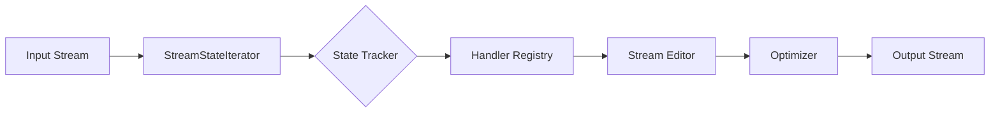

# pdfbeaver

> **A robust, context-aware PDF content stream editor.**

  

**pdfbeaver** is a low-level library for programmatically modifying PDF content streams. It bridges the gap between **reading** PDFs (calculating text positions, tracking graphics state) and **writing** PDFs (injecting operators, removing content).

It is built on top of [pikepdf](https://github.com/pikepdf/pikepdf) (QPDF) for structural integrity and [pdfminer.six](https://github.com/pdfminer/pdfminer.six) for precise stream parsing.

## 🚀 Key Features

* **Context-Aware Editing:** Modify operators based on the current graphics state (Font, Color, Matrix, CTM).
* **Safe Recursion:** Automatically traverses and modifies **Form XObjects**, ensuring nested content is treated exactly like page content.
* **State Tracking:** Tracks the cursor position ($x, y$) and transformation matrices ($Tm, CTM$) as you parse.
* **Peephole Optimization:** Includes passes to remove dead stores (unused graphics state updates) to keep output files small.
* **Robust:** Handles infinite recursion loops, malformed streams, and Type 3 font complexities.

## 📦 Installation

```bash
pip install pdfbeaver
```

*(Note: Requires `pikepdf` and `pdfminer.six`)*

## ⚡ Quick Start

### 1. Simple Operator Replacement
Change all text color to Red.

```python
import pikepdf
from pikepdf import Operator
from pdfbeaver import process, HandlerRegistry, StreamContext

# 1. Open PDF
pdf = pikepdf.open("input.pdf")

# 2. Define Logic
registry = HandlerRegistry()

@registry.register("Tj", "TJ", "'", '"')
def make_text_red(operands, context: StreamContext, raw_bytes: bytes, op: str):
    # Return a sequence of instructions:
    # 1. Set RGB color to Red (1, 0, 0)
    # 2. Draw the original text
    return [
        ([1, 0, 0], Operator("rg")),  # Non-stroking red
        ([1, 0, 0], Operator("RG")),  # Stroking red
        raw_bytes                     # Original text op
    ]

# 3. Process
# This automatically handles all pages and recurses into XObjects
process(pdf, registry=registry)

pdf.save("output_red.pdf")
```

### 2. Context-Aware Modification (Redaction)
Delete text only if it appears in the top-left quadrant of the page.

```python
import numpy as np
from pdfbeaver import extract_text_position

@registry.register("Tj", "TJ")
def delete_top_left(operands, context: StreamContext, raw_bytes: bytes, op: str):
    # 1. Get current position from the State Tracker
    # Returns np.array([x, y, 1.0]) in User Space
    pos = extract_text_position(context.pre_input)
    
    x, y = pos[0], pos[1]
    
    # 2. Check Logic (e.g., Top Left of an A4 page)
    if x < 300 and y > 400:
        return None # Return None to delete the operator
        
    return raw_bytes # Pass through unchanged
```

## 🏗 Architecture

`pdfbeaver` solves the hard problem of mapping input geometry to output streams without rendering the PDF to an image.



1.  **StreamStateIterator:** Wraps `pdfminer` to interpret the stream byte-by-byte, updating a virtual graphics state (Matrices, Fonts).
2.  **HandlerRegistry:** Intercepts specific operators defined by the user.
3.  **StreamEditor:** Recompiles the stream. It injects modified operators or passes original raw bytes for maximum speed and fidelity.
4.  **Optimizer:** Runs a post-processing pass to clean up redundant operators (e.g., `1 0 0 rg` followed immediately by `0 1 0 rg`).

## 📚 Advanced Usage

### The `StreamContext`
Every handler receives a `context` object containing:
* `context.tracker`: The active state tracker (access `gstate`, `textstate`, `get_current_user_pos()`).
* `context.page`: The `pikepdf.Page` object currently being processed.
* `context.container`: The specific object being processed (could be a Page or a Form XObject).

### XObject Recursion
Modern PDFs (and those exported from InDesign/Illustrator) often wrap content in **Form XObjects**.
* **Standard Parsers** often miss this text.
* **pdfbeaver** detects `Do` operators and recurses into the XObject resource automatically. You don't need to change your code; your handlers just work.

## 🤝 Relationship with `pdf-font-replacer`
`pdfbeaver` was extracted from [pdf-font-replacer](https://github.com/your-username/pdf-font-replacer).
* **pdfbeaver**: The generic engine. Handles reading, parsing, writing, and state tracking.
* **pdf-font-replacer**: The application. Handles Font width calculation, text reflow logic, and complex layout adjustments.

## 📄 License
MIT License. See `LICENSE` for details.