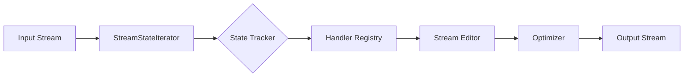

# pdfbeaver

> **A context-aware PDF content stream editor.**

  

**beaver**: an animal which manipulates water streams.

**pdfbeaver**: a library which manipulates PDF content streams.

pdfbeaver bridges the gap between **reading** PDFs (calculating text positions, tracking graphics state) and **writing** PDFs (injecting operators, removing content). Using pdfbeaver, you can easily write pdf content stream filters which are aware of "where you are on the page" at any given moment inside the content stream.

Example applications:

- change colors of PDF text and vector graphics
- redact PDF text content without disrupting the rest of the text
- optimize vector paths in PDF graphics
- replace fonts in a PDF file

It is built on top of [pikepdf](https://github.com/pikepdf/pikepdf) (and [qpdf](https://github.com/pikepdf/pikepdf)) for PDF writing/manipulation and [pdfminer.six](https://github.com/pdfminer/pdfminer.six) for stream parsing and state tracking.

## 🚀 Key Features

- **User-friendly API:** register stream editing methods using decorators.
- **Context-Aware Editing:** Modify operators based on the current graphics state (Font, Color, Matrix, CTM).
- **Safe Recursion:** Automatically traverses and modifies **Form XObjects**, ensuring nested content is treated exactly like page content.
- **State Tracking:** Tracks the cursor position ($x, y$) and transformation matrices ($Tm, CTM$) as you parse.
- **Peephole Optimization:** Includes passes to remove dead stores (unused graphics state updates) to keep output files small.

## 📦 Installation

```bash
pip install pdfbeaver
```

*(Note: Requires `pikepdf` and `pdfminer.six`)*

## ⚡ Quick Start

### 1. Simple Operator Replacement

Change all text color to Red.

```python
import pikepdf
import pdfbeaver

pdf = pikepdf.open("input.pdf")

@pdfbeaver.register("Tj", "TJ", "'", '"')
def make_text_red(op, operands, raw_bytes):
    # Return a sequence of instructions:
    # 1. Set RGB color to Red (1, 0, 0)
    # 2. Draw the original text
    return [
        ([1, 0, 0], "rg"),  # Non-stroking red
        ([1, 0, 0], "RG"),  # Stroking red
        raw_bytes           # Original text op
    ]

pdfbeaver.process(pdf)
pdf.save("output_red.pdf")
```

### 2. Context-Aware Modification (Redaction)

Delete text only if it appears in the top-left quadrant of the page.

```python
@pdfbeaver.register("Tj", "TJ")
def delete_top_left(context):
    x, y = pdfbeaver.extract_text_position(context.pre_input)[:2]
    if x < 300 and y > 400:
        return None
    return pdfbeaver.UNCHANGED # Pass through unchanged
```

### Flexible Signatures

The `@register` decorator inspects your function signature. You can include any of the following arguments in any order:

- `operands` (or `args`): List of arguments for the operator.
- `operator` (or `op`): The operator string (e.g. "Tj").
- `raw_bytes`: The original binary data for this instruction.
- `context`: The `StreamContext` object.
- `pdf`: The `pikepdf.Pdf` document.
- `page`: The `pikepdf.Page` object.

## 🏗 Architecture

`pdfbeaver` solves the problem of mapping input geometry to output streams incrementally, allowing state to be interrogated mid-stream.



1. **StreamStateIterator:** Wraps `pdfminer` to interpret the stream byte-by-byte, updating a virtual graphics state (Matrices, Fonts).
1. **HandlerRegistry:** Intercepts specific operators defined by the user.
1. **StreamEditor:** Recompiles the stream. It injects modified operators or passes original raw bytes for maximum speed and fidelity.
1. **Optimizer:** Runs a post-processing pass to clean up redundant operators (e.g., `1 0 0 rg` followed immediately by `0 1 0 rg`).

## 📚 Advanced Usage

### The `StreamContext`

Every handler receives a `context` object containing:

- `context.tracker`: The active state tracker (access `gstate`, `textstate`, `get_current_user_pos()`).
- `context.page`: The `pikepdf.Page` object currently being processed.
- `context.container`: The specific object being processed (could be a Page or a Form XObject).

See `docs/` for documentation. (Hopefully this will appear on `readthedocs` some day.)

## 📄 License

MIT License. See `LICENSE` for details.
